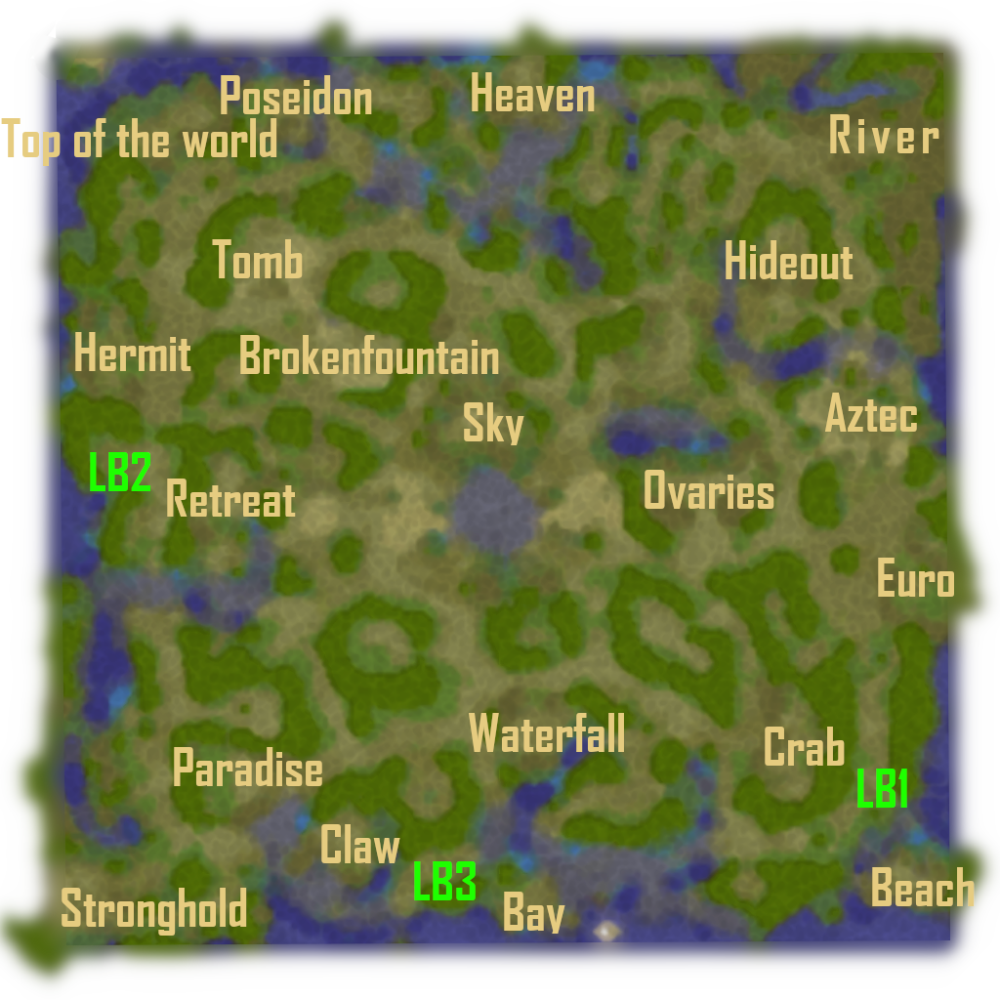

# Terminology

### Terms

- mana mound = when the titan bought a mana item to use items like wotw from mound
- abuse = titan who feeds off of clueless newbs
- fake tp = the gold mound fake teleportation ability
- mini = titanious minion
- mini-mini = small units the minions can spawn
- pool = buying items for someone they can sell for lumber
- rush = builders combining units early to rush the titan while he is weak

### Builders

- ara = arachnid
- demo = demonologist, if the context is for a builder
- drae = draenei
- fae = faerie
- gob = goblin
- mag = magnataur
- mak = makrura
- nat = nature
- rad = radioactive
- sat = satyr

### Titans

- demo = demonicus, if the context is for a titan
- volt = voltron
- bub = bubonicus
- luci = lucidious
- glac = glacious
- gran = granny = granitacles
- breeze = breezerious
- molt = moltenious
- arb = arborious
- foss = fossurious

### Abbreviations

- lb = lumber base, a temporary base which builders have no intention to defend, just to gather lumber
- wb = worker block, shelters at specific positions in a base which spawns workers to block the titan while sieging
- ij = item jump, see jump section
- ww = windwalk = invisibility
- cd = cooldown
- fb = first blood
- eb = early base
- tit = titan
- mia = missing in action, refers to titan not showing on the map
- gs = gold stolen
- g = gold
- sui = intentionally kill your minion or builder
- tp = staff of teleportation or teleportation abilities
- integers 40-49 = usually refers to the current super critter counter
- sc = supper critter
- glyph = experience glyph
- rc = research center
- arc = advanced research center
- merch = merchant
- ult = ultimate tower
- rw = rewall
- oj = orange

### Common items

- wotw = wand of the wind
- turtle = turtle scales
- float = floating eye of the ocean
- pearl = pearl of vision
- msog = mystic staff of the gods
- mirror = ethereal mirror
- dagon = nukerod = blasting wand
- aot = armor of tides
- trident = titanic trident
- gem = gem of haste
- feet = webbed feet

### Base names

Some AKAs for the bases are euro = palace, vag = ovaries, river = top right, top of the world = top left. LB1, LB2, LB3 are good lumber bases for new players, I refer to them in other sections.

    

