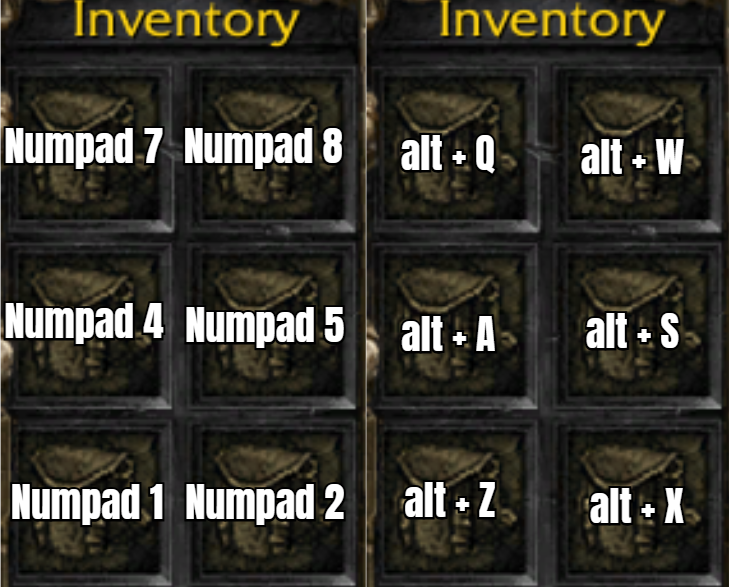

### Basic Hotkeys

- <kbd>Enter</kbd> brings up the chat box and also sends the message.
- <kbd>Esc</kbd> will cancel in-progress upgrades, training, or buildings
- <kbd>Spacebar</kbd> brings you to your most recent work completed or alerts such as “We’re Under Attack!” or any other map signals too
- <kbd>l click</kbd> x2 on hero icons or Hold Click on unit-profile image to center view on the unit
- <kbd>l click</kbd> x2on a unit to select all of that specific unit type
- <kbd>Ctrl</kbd> while clicking a unit will also select all of that unit type, doing it again on a unit of the same type outside of your selection will do a new selection but units already selected will have a lower priority to join the new selection.
- <kbd>Shift</kbd> to add or remove individual units from the selected group
- <kbd>Shift</kbd> + Command will rally unit actions into a string of events
    - Example: send builder back to harvesting lumber after finishing building or use with rally points to prevent units from getting trapped in the wrong spot
- <kbd>Tab</kbd> allows you to cycle through unit types that are selected within a group
- <kbd>F1</kbd> <kbd>F2</kbd> and <kbd>F3</kbd> will select your heros
- Arrow keys can scroll your view/screen (same as using the mouse)
- Middle mouse click will let you grip and move the camera, best way to move camera as your mouse remains centered in the action
- <kbd>Ins</kbd>/<kbd>Del</kbd> will rotate camera angle, and the Mouse Wheel zooms in and out
- <kbd>+</kbd> and <kbd>–</kbd> will change the game speed in single player (online is always fastest)
- <kbd>Alt</kbd> + <kbd>Q</kbd> brings up the quit menu and <kbd>Alt</kbd> + <kbd>Q</kbd><kbd>Q</kbd> will exit the game
- <kbd>F10</kbd> is main menu, <kbd>F11</kbd> Allies menu, <kbd>F12</kbd> is the Chat Log, and <kbd>F9</kbd> for Quests, the quest menu shows some interesting things such as builder/titan speech.
- <kbd>Alt</kbd> + <kbd>l click</kbd> will send a map ping, or signal, to your ally’s on their map radar

Rally Points and Way points allow you to Queue multiple commands or actions to your units. Hold Shift to give units multiple orders in a row. Flags show up representing each of the actions that you told them to make.


Unit Formation (<kbd>Alt</kbd>+<kbd>F</kbd>) will affect the way your units move. Units in formation move slower, at the speed of the slowest unit in the select and will align themselves. Units that are out of formation will move faster but, they will scatter around. You don't want this enabled.


Inventory hotkeys are used for items. They are designated to the Numpad <kbd>1</kbd><kbd>2</kbd><kbd>4</kbd><kbd>5</kbd><kbd>7</kbd><kbd>8</kbd>. As of reforged these can now be changed, however you can't bind it to an <kbd>alt</kbd>/<kbd>ctrl</kbd>/<kbd>shift</kbd> modifier which makes it basically useless as these are default inventory hotkeys for other MOBAs such as DotA 2. To solve this we can remap the keys via autohotkey to whichever we want. Some people think that is cheating, but it’s not, it's just rebinding one key to another. 

### Setting up inventory hotkeys

**Lazy method (1 min):** Download BurnShadys precompiled autohotkey script which is found [here](https://entgaming.net/forum/viewtopic.php?f=104&t=17325#p81045) on the ENT forums. 

**Customizable method (10 min):**

1. Download and install autohotkey at [https://www.autohotkey.com/](https://www.autohotkey.com/).
2. Create a new file and name it whatever you want, for example `my_inventoryhotkeys.ahk` **Make sure the file extension is ahk**
3. Open the file with any text editor, for example notepad
4. Paste in the following autohotkey code

    ```
    #SingleInstance force
    !w::Send {Numpad8} ;Alt + w = Numpad8
    !a::Send {Numpad4} ;Alt + a = Numpad4
    !s::Send {Numpad5} ;Alt + s = Numpad5
    !z::Send {Numpad1} ;Alt + z = Numpad1
    !x::Send {Numpad2} ;Alt + x = Numpad2
    !q::Send {Numpad7} ;Alt + q = Numpad7
    ```

    ??? tip "basic autohotkey syntax"
        - `!` is the symbol for <kbd>alt</kbd>
        - `^` is the symbol for <kbd>Ctrl</kbd>
        - `+` is the symbol for <kbd>Shift</kbd>
        - Anything to the left of `::` is the input, and anything to the right is the output.
        - For example, `!w::Send {Numpad8}` means that pressing <kbd>Alt</kbd> + <kbd>W</kbd> will instead send <kbd>Numpad8</kbd>.
        - You can ask chatgpt, claude, or any other clanker if you want different keybinds.
        - `#SingleInstance force` ensures that only one instance of the script can run at a time.

5. Save and close the file
6. Right click the file and if you installed autohotkey correctly you can choose to either run the script or to compile the script.
7. To stop running the script right click it down in the systems tray and click exit.


### Default inventory keybinds vs with ahk script

<div style="text-align:center;">
    
</div>
