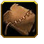
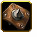
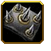
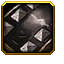
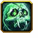
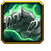
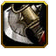
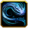
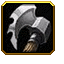
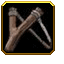

# Armor and Attack Types

Island defense has custom damage/attack types and as to not confuse us with the default wc3 types they are renamed, reskinned, and have different values. I've simplified the table by removing armor/damage types that no unit has, if I'm mistaken, contact me and I'll add it back. Tooltips in game are notoriously inaccurate, these numbers are accurate as of april 2026 taken from the world editor.

| Type             |  **Light** |  **Medium** |  **Heavy** |  **Fortified** | **Titanic**  |
|------------------|-------------|--------|--------------|------------|-------------------|
| **Titanic**   | 2.00        | 0.90   | 0.75         | 0.55       | 1.00              |
| **Heroic**   | 1.50        | 1.50   | 1.50         | 1.00       | 1.00              |
| **Magic**            | 1.00        | 1.00   | 1.00         | 1.00       | 1.00              |
| **Physical** | 1.25        | 1.00   | 0.75         | 0.75       | 1.00              |
| **Ranged**   | 1.00        | 1.00   | 0.55         | 0.35       | 0.50              |

### Armor types

 **Light**

 - Harvesters, mini-minions, tidal spawn

 **Medium**

 - Most builders, most towers, fruits

 **Heavy**

- Tauren, magnataur, earth panda, upgraded demonologist and ogre, mobile catapult, minions, spirit of fire

 **Fortified**

 - Walls, arc, ulti towers, rc

 **Titanic**

 - Titan

### Attack types

 **Titanic**

- Titan, titan minions, mini-minions, tidal spawn, spirit of fire, succubus

 **Heroic**

- Hunters, huntress wolf spawns, firepanda, some ulti towers, morphling beastform, tauren

 **Magic**       

- Faerie, demo pools

 **Physical** 

- Most builders, spearlocs, magnataur snowman, tauren guard  

 **Ranged**

- All towers, fruits, ranged summon units, some ulti towers, huntress

### Observations

- Ulti towers whose damage types are heroic do more damage, doesn't necessarily mean they are better for the situation though.
- Hunters and some units are very effective vs minions.
- Huntress attack damage upgrades are not worth it due to the poor dmg factor vs titanic / heavy.
