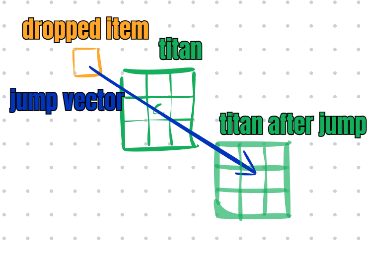
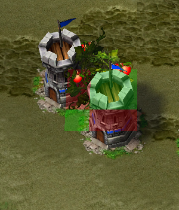
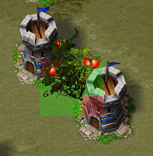
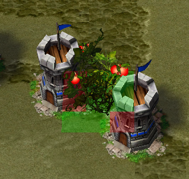

# Item jump

Item jump is another type of jump, contrary to all other jump it's hard coded into Island Defense and therefore it will not work for any other map. The system has had long history in Island Defense as it originated as a bug in the Warcraft III game engine where items dropped on the ground would not be pathable by invisible units. Melee players disliked this bug because it allowed blademaster to jump deep into enemy bases and harass their peasants so on August 8th 2018 blizzard released patch 1.30.0 which fixed this bug, and you could no longer item jump... Until April 2025 when it was added it back into the map.

The same rules for cliff height applies to item jump, you can only jump to the same cliff height. Only a titan unit can jump with it, pirate and troll can try, but it won't work for them. 

For whoever is interested the source code is available to view in an obscure channel in the discord where it goes into detail about ranges of the jump and how it searches for target positions. However it's sufficient for us to know that when an item is dropped by an invisible titan it pushes the titan away in the opposite direction of the item drop location, as per the image below. Any type of item will jump you.

    

### Jumpable geometries

Instead of grabbing our rulers and calculating distances it's more convenient to know that some geometries are jumpable and others aren't. There are 3 unique geometries which are jumpable, their mirrored counter parts are also jumpable, and they are all jumpable in any direction. For anyone wanting to prevent item jumps through their walls they need to avoid building like this. 

    
    
    

### Example jump

Video showing jumping each of the 3 different geometries.

    <video controls width="1080">
        <source src="../img/itemjump/itemjump.mp4" type="video/mp4">
    </video>

