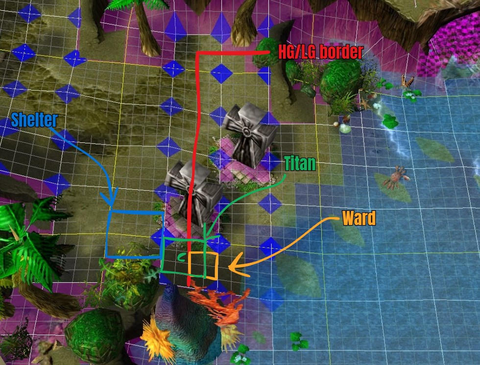
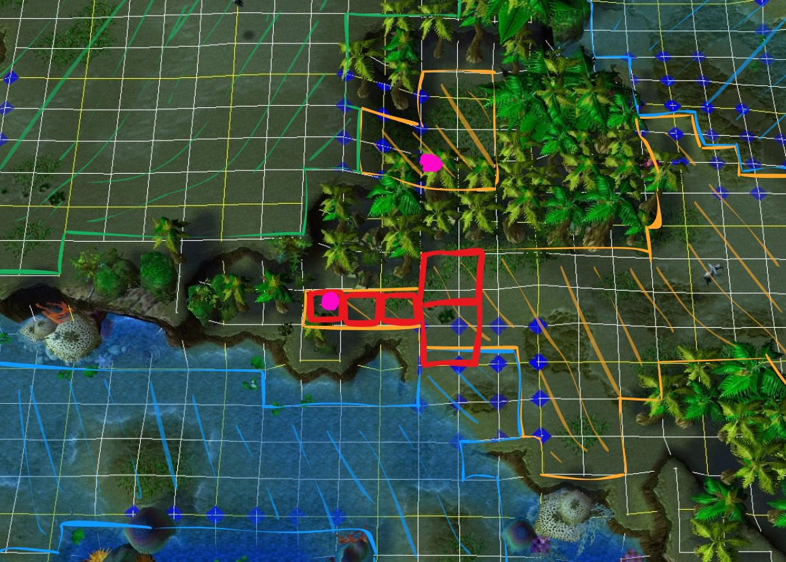

# Jumping
Unit collisions are a common occurrence in all Warcraft III maps, the engine is programmed for these collisions to be resolved as naturally as possible for normal melee WC3 and its campaign. However these design choices give rise to some interesting consequences. When two units collide, depending on the cause of the collision the game will attempt to separate the unit who caused the collision. The jump process is as follows.

### 1. Collision occurs
Two units collide. The possible causes are listed later.

### 2. The game searches for a valid position

- Search begins southwest (roughly 7 o’clock) from the collision point.
- Search expands counterclockwise.
- Each full rotation increases the search radius up to a maximum distance determined by the jump type.

Short jumps search up to roughly 143 range (possibly +32 units uncertainty, due to my laziness testing), slightly farther than the width of a wall.

Long jumps search up to roughly 1088 range (possibly +32 units uncertainty, due to my laziness testing), roughly equivalent to 8.5 wall lengths.

For a position to be valid it must meet the following criteria:

- Be pathable
- Be on the same cliff level where the collision occurred (see the ramp section for details)

This cliff-level restriction is what enables many jumps.

### 3.a If a valid position was found
The unit responsible for the collision is moved to the found location.

### 3.b If a valid position was not found
The game will accept the units colliding. With the following exceptions

- Radioactive exiting a hunter
    - The exit is prevented.
- Unit teleporting to a building
    - The spell or item is consumed, but the teleport fails.
- Unit spawning from a building
    - The spawn repeatedly retries until successful or canceled.
    - An error sound and message are played for all players.
    - Titan hunters spawning are exempt from this behavior, but resurrecting hunters are not.

Below are all sources of collision, this list isn't exhaustive for all types of collisions in WC3 but it is for Island Defense as of writing this in april of 2026. If for example blade masters mirror image ability would be added it would be a long jump.

## Short jumps

- Unit exiting invisibility 
- Unit returning lumber 
- Radioactive exiting hunter

## Long jumps

- Unit teleporting to a building 
- Unit spawning from building or any source such as molt ult
- Unit spawning in from ankh 
- Unit exiting invisibility while being stuck in a building from mirror 
- Unit emerging from burrow 
- Unit entering burrow 
- Unit emerging from tunnel
- Unit harvesting lumber wisp style and stops
- Unit building a building

## Example 1

This jump is interesting because it appears blocked by the shelter and builders feel safe but we can jump it.

    <video controls width="1080">
        <source src="../img/wardjump.mp4" type="video/mp4">
    </video>

Let's break down what's happening.

1. Preparation
    - The mound is given voodoo ward + mana item + using regen pot to get mana. This is so it can use the voodoo ward.
2. Titan moves into position.
3. Ward is dropped.
4. Titan breaks invisibility and collides with the ward
5. The game searches for a valid spot within 143 range to place the titan, none is found and the game accepts the collision. Notice how titan is on the highround, hence why it's not being placed down towards the water.
6. Titan attacks and kills shelter
7. The game searches again for a valid spot and now finds where the shelter once was.
8. The game jumps the titan.

    

### Example 2

A structure jump.

    <video controls width="1080">
        <source src="../img/buildingjump.mp4" type="video/mp4">
    </video>

Breakdown:

1. We build 2 fruits and 3 shelters (red poorly drawn squares).
2. The game is searching for a valid position to place our builder, as per the animation below. Starting at the violet spot.
    - No square is valid since it's either blocked by trees or doodads or it has a different cliff height, remember we must find an area on the orange cliff height.
3. We reach square 155 and a valid spot is found and the builder is jumped there. The other violet spot (kind of)

  
  <canvas id="overlay" style="position: absolute; top: 0; left: 0; width: 100%; height: 100%; pointer-events: none;"></canvas>

### Note on ethereal mirror

Mirror makes buildings in its aoe ethereal and collisionless. Here's how it works:

1. Titan casts mirror on buildings
2. Buildings affected enter pre-mirror phase.
    - Buildings taking any form of damage during the pre-mirror phase, from allied or enemy unit, will exit the process and not become ethereal.
3. After a delay, dependant on the amount of nearby towers, the buildings become ethereal and collisionless.
    - Buildings also become hostile for builders and towers will automatically attack them. Any amount of damage will make them exit ethereal state.
4. Buildings exit ethereal state and become normal.

Builders are not notified by "Our base is under attack" or "An allied base is under attack" from mirror. To counter mirror you can either be extremely attentive and autoattacking the your walls after titan cast mirror with your towers or you can blinkproof your base.

### Note on the WC3 search / spawn algorithm

Familiarize yourself with how the search works, check the animation above or experiment yourself in game by spawning workers from a shelter without rally point. Many things in WC3 use this algorithm to search for valid spots or for units, for example when a shop determines which unit it should sell to, or how it should select units when you double click a unit, etc. The only exception for this search I've noticed is of course pathfinding but also when a worker searches for a tree to lumber from, which I found interesting why they made an exception for that.

??? tip "**Obscure sidenote**"
    Anyone who has studied jumping might think I have cheated people out of the true explanation, which might be true, but this model is good for nearly all purposes.
    
    I intentionally left out that there are 2 "collision separators", a long one and a short one. Some actions invoke the long one, and others invoke the short one. Exiting invisibility for example invokes the short one, issuing an attack command, move command, stop command, or ability invokes the short collision separator. 

    It was more necessary to know about this pre-2018 when the old item jump existed because you could both short and jump long with items depending on which collision separator was invoked. In the current version you might notice if you mirror walls which become collisionless, you don't need invisibility to path through them, but as they regain their collision and you are still in the walls you become stuck. This is because no collision separator was called, you could either invoke the short collision separator by for example issuing a stop command, but if there is no available space you need to invoke the long separator by exiting invisibility.

    Another example if you are stuck in a building by covering an entire cliff height with buildings you don't immediately jump out if some space next to where you are stuck is emptied, but if you exit invis you can invoke the long separator or if you issue a stop or attack command you can invoke the short one.