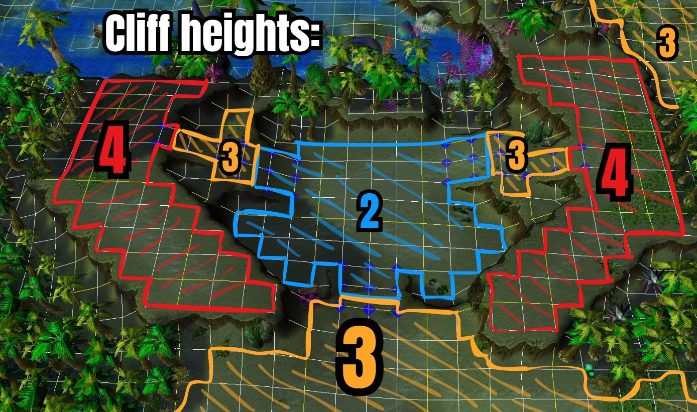
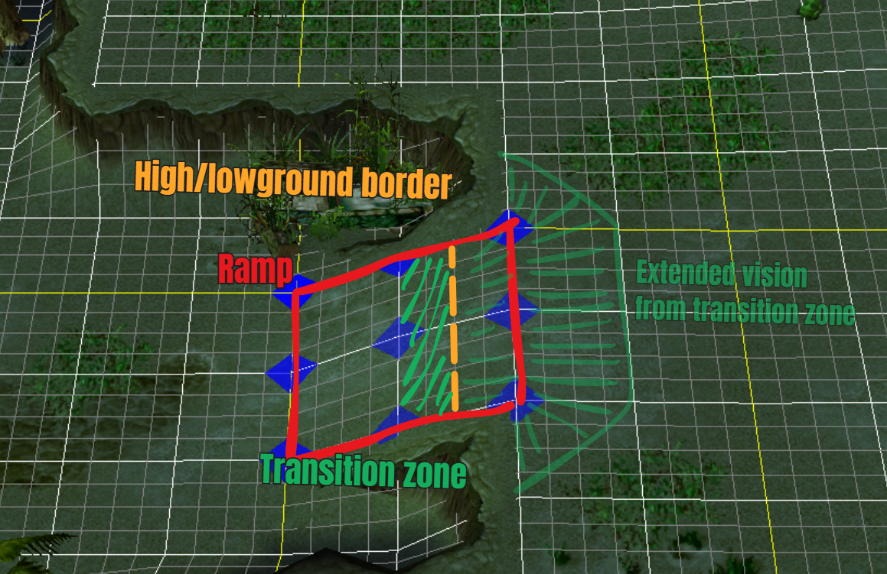
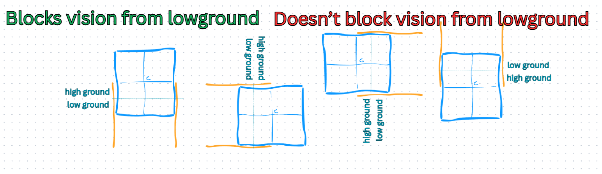

## Cliff heights

A Warcraft III map is divided into discrete cliff heights.

When a unit is jumping, it cannot move to a different cliff height. This restriction is fundamental to how jumps behave.

    

## Anatomy of a ramp

A ramp connects two different cliff heights. While ramps may appear visually different, they all fundamentally work the same. 

A ramp is 256 units long (the length of two walls):

- The first 192 units are considered low ground
- The remaining 64 units are considered high ground

A unit or building whose center is inside the transition zone is treated as being on the low ground. However, units in this area are granted vision up the remainder of the ramp and an additional 128 units onto the high ground.

    

# Ramp vision block

Using our understanding of ramps and building centers, we can create situations where a building blocks vision across a ramp.

Consider a 4x4 building (256x256) placed so that it covers both the transition zone and the high ground.

Depending on the ramps orientation:
- In two orientations, the building center remains outside the ramp
- In the other two, the center lies inside the ramp

Based on the terrain rules described earlier, all four cases would be expected to block vision equally. However, only the orientations where the building center lies outside the ramp fully block vision. I don't have a satisfactory explanation for this, one can only assume blizzard hardcoded that you are able to see any building whose center is on the ramp.

    

