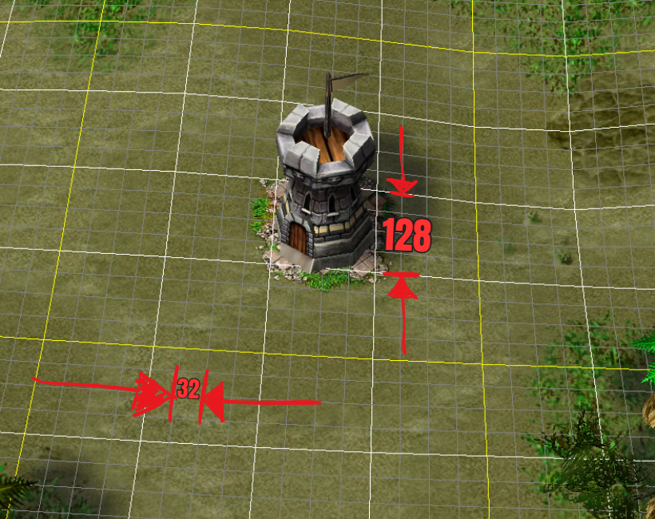
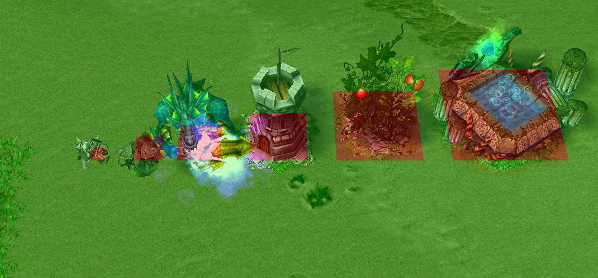
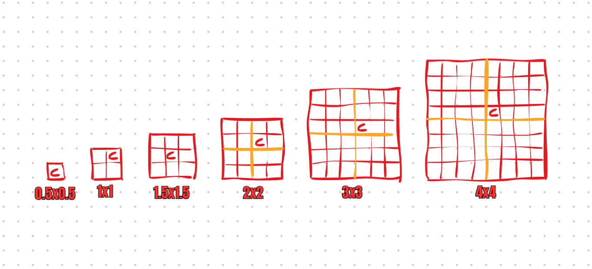

# Grid and unit sizes

A warcraft III map is divided into small squares, in game while placing buildings you can't place buildings at its true resolution, you can only build every 64 units, not every 32 units. Each square is 32x32 units, so a wall is 128x128. It's impractical to refer to sizes this way so we call a wall being of size 2x2. It's still good to be aware of the true length because it indicates the range of abilities, attacks, vision etc. A unit with movespeed of 300 means it will move 300 units in one second. 

    

## Unit/building dimensions

There are 6 sizes any unit or building has. See the picture below. 

List of different relevant units who has these sizes, range units / intuitive units

- 32x32 / 0.5x0.5
    - Mini-minions, items dropped on the ground (these are pathable, just unbuildable)
- 64x64 / 1x1
    - Builders, wards, tidal spawns, phoenix egg
- 96x96 / 1.5x1.5
    - Titan (contrary to what we tell noobs, titan isn't 2x2), minions, hunters, spirit of fire
- 128x128 / 2x2
    - Walls, towers
- 192x192 / 3x3
    - Fruits, arc
- 256x256 / 4x4
    - Merch, rc

    

## Center of buildings and units

Each 32x32 square on the grid has a cliff height, a unit or building will be on the cliff height its center is on. It's not obvious for all unit sizes which square will be the center but you can figure it out experimentally. Below is the center for all sizes. This is important to understand for buildings built on the border on ramps as they will only be able to spawn units on the same cliff height which the center square is on, same for orc style builders are considered to be on the center square while constructing their building.

    

